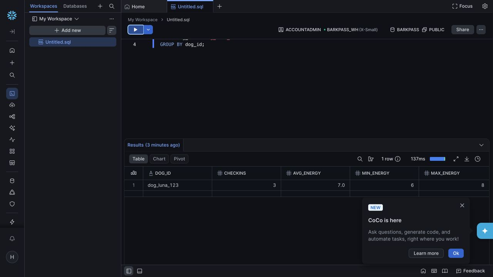

# BarkPass submission verification

Verified against the Vercel Preview on August 15, 2026.

## Five-photo Gemini acceptance set

| Case | Gemini mood | Energy | Confidence | API latency |
| --- | --- | ---: | ---: | ---: |
| Real photo 1 | Playful | 6/10 | 0.80 | 10.53 s |
| Real photo 2 | Playful | 9/10 | 0.90 | 4.30 s |
| Real photo 3 | Anxious | 4/10 | 0.40 | 8.38 s |
| Real photo 4 | Relaxed | 7/10 | 0.90 | 6.81 s |
| Real photo 5 | Alert | 7/10 | 0.80 | 4.68 s |

The set produced four distinguishable moods and an energy range from 4 to 9. Average Gemini latency was 6.94 seconds.

After the provider migration, a fresh real-photo call on the BarkPass Preview returned `Playful`, energy `9/10`, confidence `0.90`, visible posture notes, and `provider: gemini`.

## ElevenLabs latency

The live voice call returned an 84,889-byte MP3 in 1.55 seconds. Combined with the slowest Gemini request, the measured provider path was 12.08 seconds, below the 15-second acceptance target.

The migrated ElevenLabs credential was rechecked through BarkPass and returned HTTP 200 with a 39,750-byte MP3 carrying a valid ID3 header.

## Solana

The live server prepared an unsigned 0.01 SOL devnet shelter-tip transaction. The approved Luna BarkPass mint was then broadcast and finalized successfully on Solana devnet.

- Mint: `AAutLzLLaXR74Dfr1jtJdftQunCtQu7P6QzrYNoPmeK3`
- [Mint on Solana Explorer](https://explorer.solana.com/address/AAutLzLLaXR74Dfr1jtJdftQunCtQu7P6QzrYNoPmeK3?cluster=devnet)
- [Finalized mint transaction](https://explorer.solana.com/tx/3Y7VExjN5i9nU6ZPmjWW8nVW53ZWF7vJUX48EEQYtgWnmh9kmNiKTjknNNfxKatwUWs8RP2P4SnZ6vpbKzCdTi4m?cluster=devnet)
- RPC verification: finalized with no error; mint initialized with supply `1` and `0` decimals
- Public metadata: verified from `https://barkpass-dog-days.vercel.app/api/passport-metadata`
- Migrated vault: `9RjmJveGakYhFM8EA13Gx5aT4sMtdqxXWtbXXFfgqX7E`, funded with `0.5` devnet SOL
- New-vault proof: BarkPass returned a live unsigned 0.01 SOL transaction with the migrated vault as shelter; no additional NFT was broadcast during the migration

The shelter tip is still unsigned because its final broadcast requires the owner's Phantom approval.

## Snowflake

The new 120-day student trial is active. Setup and proof used:

- Account: `fzcxuvj-bt58985`
- Warehouse: `BARKPASS_WH` (X-Small, 60-second auto-suspend)
- Database/schema: `BARKPASS.PUBLIC`
- Runtime identity: `BARKPASS_APP_USER`, a service user with key-pair authentication and a least-privilege `BARKPASS_APP_ROLE`
- Live dog profile write: `dog_luna_123` / Luna
- Live check-ins: three rows dated August 13 to 15, 2026 with energy values 6, 8, and 7
- Grounded API answer: “Across 3 Snowflake check-ins, Luna averaged 7.0 out of 10. Energy ranged from 6 to 8 and finished higher compared with the first saved day.”
- Independent worksheet aggregate: `dog_luna_123` | `3` check-ins | `7.0` average | `6` minimum | `8` maximum

## Build checks

- API contract tests: 9/9 passed
- Vite production build: passed
- Public `/app` response: HTTP 200 at https://barkpass-dog-days.vercel.app/app
- One-click `/app?demo=1` path: seven visible check-ins, average 7.0, range 4 to 9, and verified Solana example link
- Fresh-profile reveal transition: fixed and browser verified so first-time users do not see a blank dashboard
- 390 px layout: no horizontal overflow and no interactive target under 40 px
- Public dog-specific metadata endpoint: HTTP 200
- Protected provider verification: Gemini, ElevenLabs, Snowflake and Solana paths exercised; Snowflake re-verified on the BarkPass Preview with key-pair authentication
- Post-migration provider status: Gemini, ElevenLabs, Snowflake and Solana all `true` on the protected BarkPass Preview
- Vercel cleanup: obsolete `ember` project removed only after the post-migration checks passed
- Staged-diff secret scan: 0 findings
